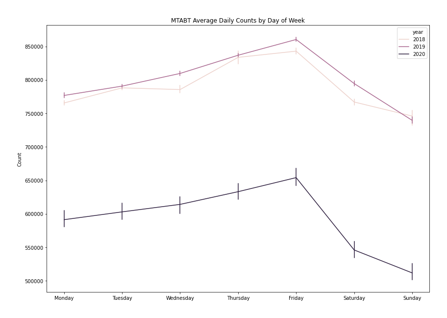
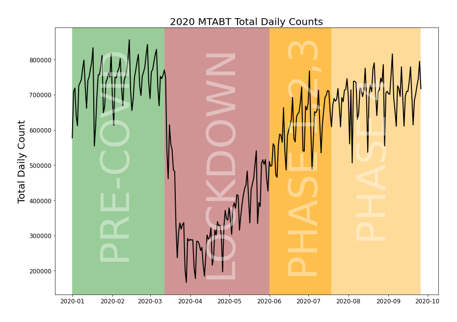

# Time Series MTA Bridges and Tunnels
Albert Um - DS Cohort 06-22-20

# Project
For this project, my objective is to forecast NYC bridges and tunnels traffic (not congestion but number of cars); given that NYC stays in phase 4. The counts can be used to convert to dollars as revenue stream or can be used to help urban developers in maintenance scheduling. Moreover, it's my take on how "normal" things are relative to pre-covid days.

# Structure of Respository
- MTABT_EDA.ipynb - notebook for plots
- MTABT_models.ipynb - notebook for models
- MTABT_forecast.ipynb - notebook for forecasting
- IMG/ - folder for plots
- /README.md

# Business Case
1. Who would be interested in this?
2. What does the forecast look for different bridges?
3. What does the forecast look for different bridges relative to prior year?

# Data

The dataset can be found [here](https://data.ny.gov/Transportation/Hourly-Traffic-on-Metropolitan-Transportation-Auth/qzve-kjga). The data is collected by Metropolitan Transportation Authority (MTA) Bridges and Tunnels. 

Information about the data.
1. The data contains hourly counts of 10 unique bridges.
2. The hourly count per bridge is separated to EZ-Pass and Cash
3. The data ranges from 2010-2020

For more information about the dataset, please look to plaza_id.txt or [here](https://data.ny.gov/api/views/qzve-kjga/files3cc7ddd0-d7f2-4bf7-befd-2c0dcd0031fa?download=true&filename=MTA_HourlyTrafficBridgeTunnel_DataDictionary.pdf) for the original data dictionary.

## Preprocessing
For this project, I have done 
1. Use the sum count of EZ-Pass and Cash for each bridge.
2. Resample hourly data to daily by summing.
3. Use data collected from 2018 and on.
4. Join Triboro Bronx and Triboro Manhattan counts to 'Triboro'

## Feature Engineering
1. Holidays - Holidays can be grabbed from holidays package
2. Datetime Extraction - From datetime, extracting dayofweek, weekend, month, etc.
3. 2020 Events - https://www.investopedia.com/historical-timeline-of-covid-19-in-new-york-city-5071986
    - March 12 - Events with more than 500 people cancelled
    - March 22 - NYS Pause Program begins, all non-essential workers must stay home
    - April 16 - Governor Cuomo extendes the stay-at-home order and school closures to May 15
    - May 15 - Governor Cuomo extends PAUSE to May 28
    - June 8 - NYC begins Phase 1 opening
    - June 22 - NYC begins Phase 2 opening
    - July 7 - NYC begins Phase 3 opening
    - July 19 - NYC begins Phase 4 opening
4. Average Daily Temperature - https://w2.weather.gov/climate/xmacis.php?wfo=okx
    - Weather data was calculated from 2010 - 2020. I then fit just the average temperature values with a vanilla FBProphet and forecasted to 2021. I will be using the y_hat values returned from FBProphet for 2018-2021.

# Exploratory Visualizations
1. Average Daily Counts by Month
2. Average Daily Counts by Day of Week
3. Comparing 2020 with 2019
4. 2020 events

On the first plot, it seems the average daily counts of all toll traffic increases during the Q2(Apr-Jun) and Q3(Jul-Sept) and recedes for Q1(Jan-Feb) and Q4(Oct-Dec). Also, please note the stark drop for 2020. I will explain this later.

On the second plot, the average daily counts are higher on the weekdays than they are on the weekends. There is also an interesting upward trend going from Monday to Friday and recedes on the Saturdays and Sundays.

For the third plot, I am comparing NYC toll traffic on 2020 with 2019. On 2020, COVID-19(global pandemic) caused a halt as non-essential workers were required to stay home.

On March 12, events with more than 500 were cancelled. Shortly after public schools and restaurants close. On March 22, the Pause Program begins and all non essential workers must stay home. The stay at home gets extended twice until June 6; intialize Phase 1 of reopening. On July 19, NYC begins Phase 4 of reopening. 

# Model Evaluation
For EDA, I have summed up all the bridges to create more readable plots. However, there are a total of 9 toll bridges in NYC. Although they look similar(follow similar trends), I am cautious in assuming they are all the same.

In order to evaluate the models, I separate 21 of the most recent days as my test set. I decided to start the test set on 08-23-20 because I wanted to give the model at least a month of data while NYC was on Phase 4 (Phase 4 initialized on July 19).

  
This image was taken from MTA Bridge and Tunnels. Please look [here](http://web.mta.info/mta/investor/pdf/2020/AppendixEStantec.pdf) for more information.

# Models:
I used root mean squared error as the metric as it is more sensitive to robust errors than mean absolute error. I then sum the 9 rmse to artificially create an error for all the bridges.

1. Dummy Regressor - Calculate the average of the last 7 days count per bridge and forecast a horizontal line forward. 
    - RMSE: 68953
2. SARIMAX - Use features created as exogenous variables. The parameters (1,1,2)x(1,0,1,7) with trend = 'n' was found through grid search. I created 9 separate SARIMAX models( one for each bridge) and summed all errors.
    - RMSE: 43468
3. FBProphet - Use the same features (but not dummified) in add_regressor(). I made some minor adjustments on parameters but I would say its still pretty vanilla FBProphet. Same concept as SARIMAX, 9 separate FBProphet models (one for each bridge) and summed all errors.
    - RMSE: 47698
4. LGBM - Change time series into a decision tree regressor problem. Instead of having 9 separate models, I can have one gbdt model. Done by melting bridges from wide to long and adding same features as before. IN ADDITION, adding lags(lag_7, lag_28) and moving averages. Forecasting can be done in a recursive manner. (As in, forecast t+1 and recalculate the lags... forecast (t+1)+1 and recalculate lags)
    - RMSE: 44394

 

  

# Results
  
With LGBM, I have forecasted from 09-27-20 to 03-31-21. On 01-01-21, I have assumed three conditions:
1. Purple: Coronavirus is over, return back to normal; sum = 62,437,709
2. Teal: Continue with Phase 4; sum = 59,917,217
3. Red: Initiate Lockdown on January and reopen on February; sum = 38,760,724

2019 was the most recent year which didn't contain the pandemic. Therefore, I will compare the values relative to 2019 Q1.  
2019 Q1 Actual Sum: 67,324,238  

To translate these counts into dollars and into something more applicable, I will multiple each count to $6. The calculated values are just estimated but the scale remains the same.  

2019 Q1 Estimated Revenue: $403,945,428  
2021 Q1 Purple Predicted Revenue: $374,626,254  
2021 Q1 Teal Predicted Revenue: $359,503,302  
2021 Q1 Red Predicted Revenue: $232,564,344  

PLEASE NOTE: these values are _estimates_ as it's calculated crudely (count * $6).

# Conclusion
New York City is in need of funds due to multiple revenue streams lost due to COVID-19. Therefore, the city must be cautious on allocating funds. Relative to 2019 Q1 Revenue gained, the model forecasts a Q1 2021 deficit on bridge and traffic tolls by around:
1. ($29,319,174) if Coronavirus is over
2. ($44,442,126) if the city remains in Phase 4
3. ($171,381,084) if the city re-initiates another lockdown on January and reopens on February.

# Further Steps
I would like to experiment with other models such as keras LSTM and Dilated CNN to see if model performs better.  
I am also interested in making a user friendly dashboard that will plot forecasts with user inputs. (for example: I think there will be another lockdown on November 2020).

# Recommendations
I would recommend NYC of being cautious on a full lockdown. The city should introduce another manner of lockdown in which the model has never seen before. (Maybe partial lockdown?).  
Moreover, I would recommend the residents of NYC to be a lot smarter with social distancing practices. Having less cases over time can help demote reasons for another lockdown.
