# Time Series MTA Bridges and Tunnels
Albert Um - DS Cohort 06-22-20

# Project
For this project, my objective is to forecast NYC bridges and tunnels traffic (not congestion but number of cars); given that NYC stays in phase 4. The counts can be used to convert to dollars as revenue stream or can be used to help urban developers in maintenance scheduling. Moreover, it's my take on how "normal" things are relative to pre-covid days.

# Structure of Respository
- MTABT_EDA.ipynb - notebook for plots
- MTABT_models.ipynb - notebook for models
- IMG/ - folder for plots
- /README.md

# Business Case
1. Who would be interested in this?
2. What does the forecast look for different bridges?
3. What does the forecast look for different bridges relative to prior year?

## Data

The dataset can be found [here](https://data.ny.gov/Transportation/Hourly-Traffic-on-Metropolitan-Transportation-Auth/qzve-kjga). The data is collected by Metropolitan Transportation Authority (MTA) Bridges and Tunnels. 

Information about the data.
1. The data contains hourly counts of 10 unique bridges.
2. The hourly count per bridge is separated to EZ-Pass and Cash
3. The data ranges from 2010-2020

For more information about the dataset, please look to plaza_id.txt or [here](https://data.ny.gov/api/views/qzve-kjga/files3cc7ddd0-d7f2-4bf7-befd-2c0dcd0031fa?download=true&filename=MTA_HourlyTrafficBridgeTunnel_DataDictionary.pdf) for the original data dictionary.

## Preprocessing
For this project, I have done 
1. Use the sum count of EZ-Pass and Cash for each bridge.
2. Resample hourly data to daily by summing.
3. Use data collected from 2018 and on.
4. Join Triboro Bronx and Triboro Manhattan counts to 'Triboro'

### *Summing EZ-Pass/Cash and Hourly to Daily*
Since I am interested in the forecast of daily counts per bridge, it makes sense to add the ez-pass and cash counts and sum hourly instances by days.

### *Use data collected from 2018 and on*
On 2017, NYC finishes installing cash-less tolls. I decided to use the data from 2018 and on because pre-2017, the data was collected in a different way. The article of cashless tolling completion can be found [here](https://www.governor.ny.gov/news/governor-cuomo-announces-completion-cashless-tolling-all-mta-bridges-and-tunnels-three-months).

### *Join Triboro Bronx and Triboro Manhattan*
The Triboro Bridge consists of three bridges that connect Manhattan, Bronx, and Queens. For this project, I have decided to treat these three bridges as one.

# Exploratory Visualizations
1. Average Daily Counts by Month
2. Average Daily Counts by Day of Week
3. Comparing 2020 with 2019
4. 2020 events

On the first plot, it seems the average daily counts of all toll traffic increases during the summer seasons and recedes in the winter.

On the second plot, the average daily counts are higher on the weekdays than they are on the weekends. There is also an interesting upward trend going from Monday to Friday and recedes on the Saturdays and Sundays.

For the third plot, I am comparing NYC toll traffic on 2020 with 2019. On 2020, COVID-19(global pandemic) caused a halt as non-essential workers were required to stay home.
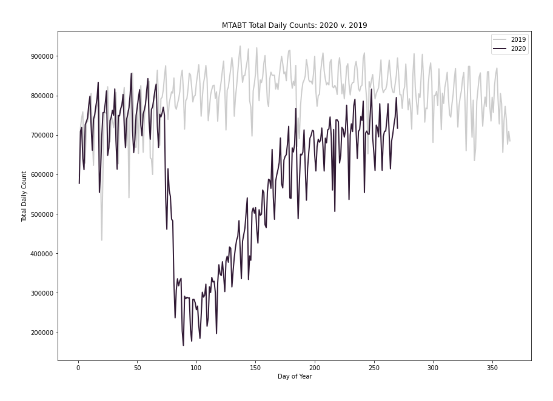

On March 12, events with more than 500 were cancelled. Shortly after public schools and restaurants close. On March 22, the Pause Program begins and all non essential workers must stay home. The stay at home gets extended twice until June 6; intialize Phase 1 of reopening. On July 19, NYC begins Phase 4 of reopening. 

# Modeling
For EDA, I have summed up all the bridges to create more readable plots. However, there are a total of 9 toll bridges in NYC. Although they look similar(follow similar trends), I am cautious in assuming they are all the same.

In order to evaluate the models, I separate 21 of the most recent days as my test set. I decided to start the test set on 08-23-20 because I wanted to give the model at least a month of data while NYC was on Phase 4(Phase 4 initialized on July 19).

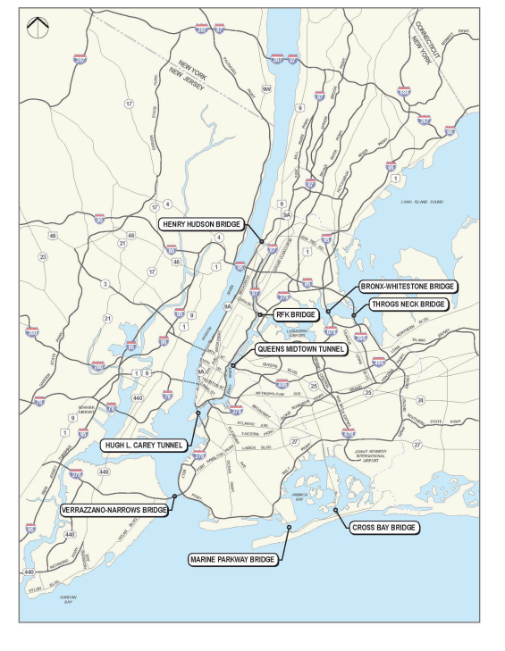  
This image was taken from Stantec's report published on April 29, 2020. 
Please look [here](http://web.mta.info/mta/investor/pdf/2020/AppendixEStantec.pdf) for more information.

I'll create 9 univariate models and each will return an root mean squared error. I used root mean squared error as the metric as it is more sensitive to robust errors than mean absolute error. I then sum the 9 rmse to artificially create an error for all the bridges.

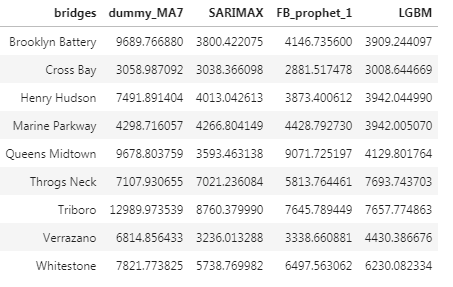  

Sum of All RMSE
>SARIMAX    &nbsp;&nbsp;&nbsp;&nbsp;&nbsp;&nbsp;&nbsp;&nbsp;&nbsp;&nbsp;     48165.277154 
FB_prophet_1  &nbsp;&nbsp;&nbsp;&nbsp;  56627.036330 
LGBM &nbsp;&nbsp;&nbsp;&nbsp;&nbsp;&nbsp;&nbsp;&nbsp;&nbsp;&nbsp;&nbsp;&nbsp;&nbsp;&nbsp;&nbsp;&nbsp;&nbsp;51393.546779 

# Results
Considering that SARIMAX had the lowest total RMSE, I'll use the selected model to forecast the rest of the year. The percentage change is computed by taking the average count for days between 2020-09-13 to 2020-12-31 versus 2019-09-13 to 2019-12-31: 
>(Average Day 2020 - Average Day 2019) / Average Day 2019 

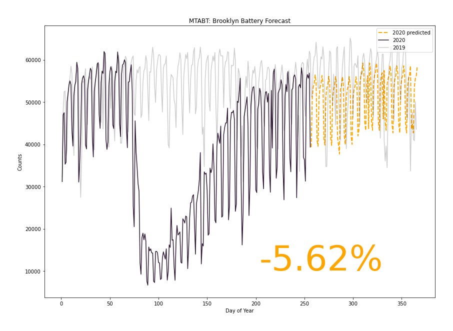  
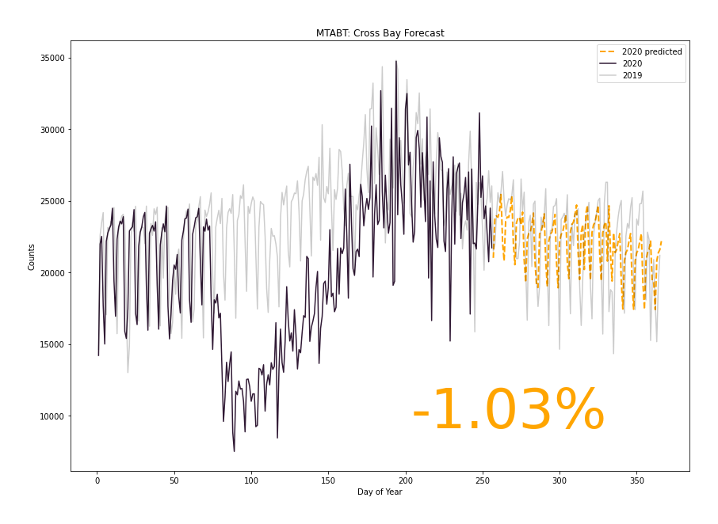  
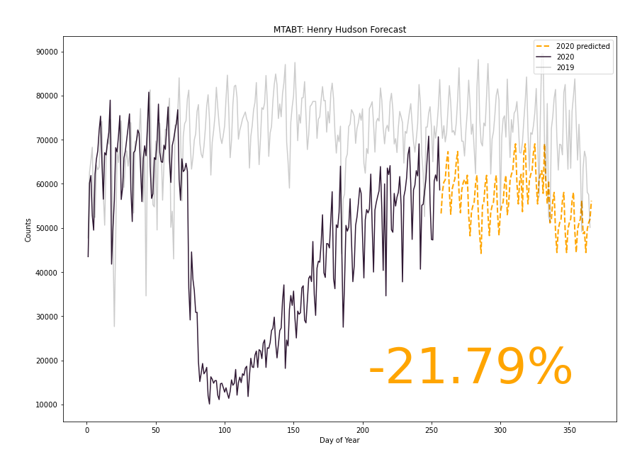  
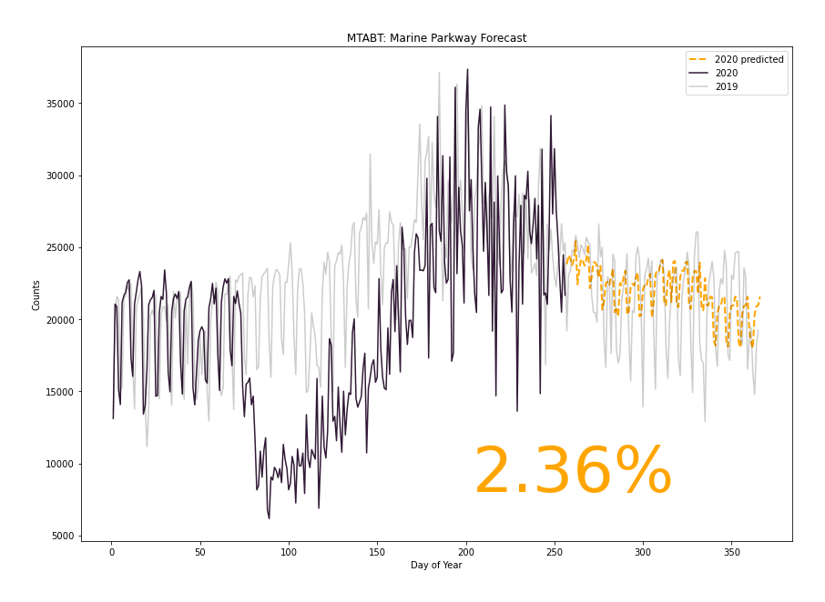  
  
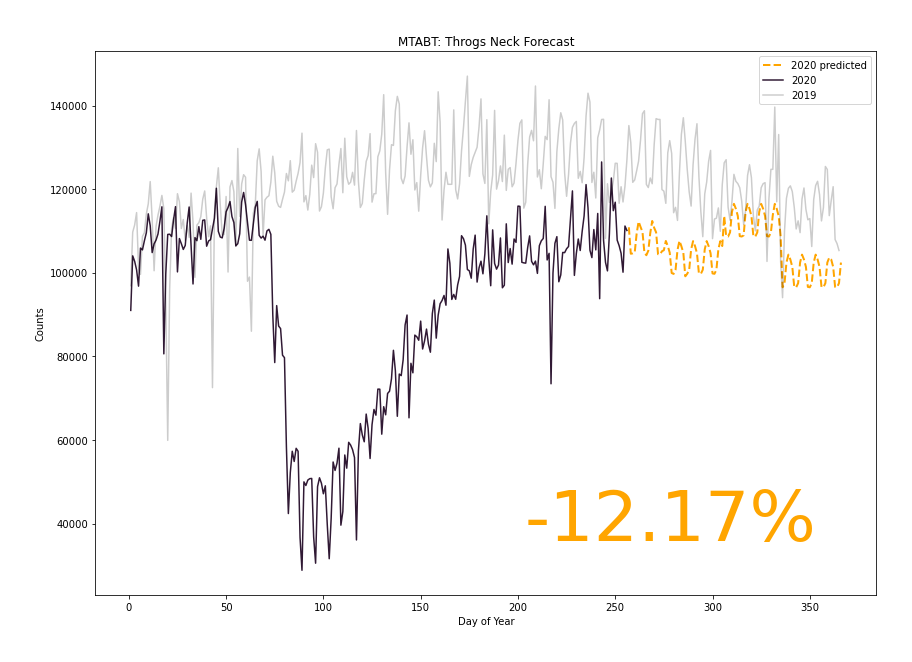  
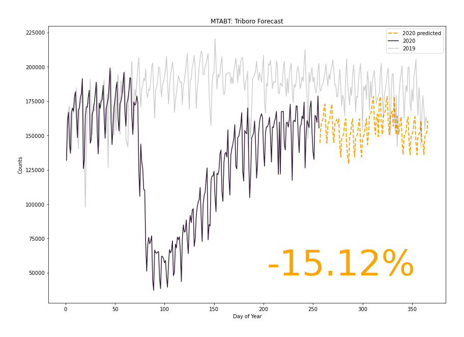  
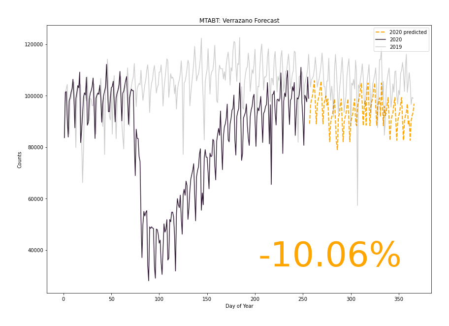  
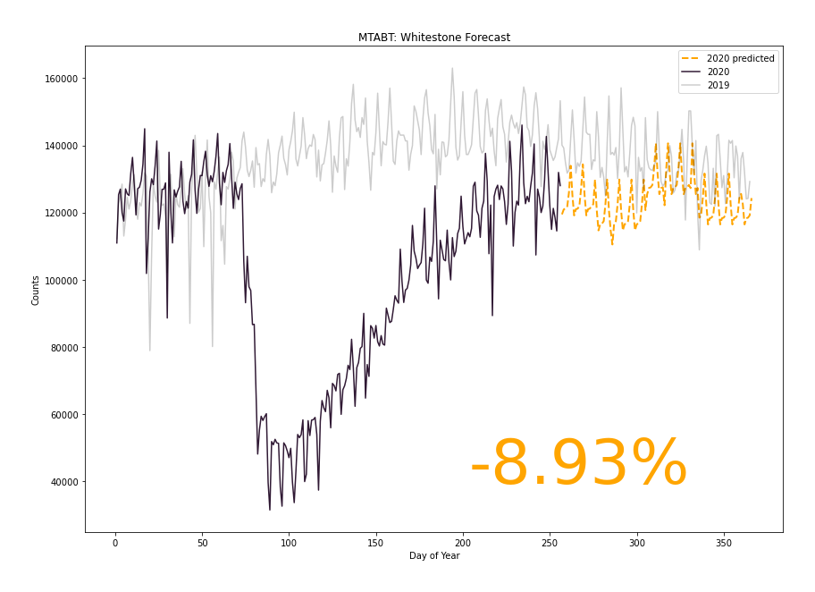  

# Conclusion
Given that NYC stays in phase 4, I have showed forecasts for bridges for the rest of the year. It's interesting to see how some bridges are forecasted to 

# Further Steps
I would like to experiment with other models such as keras LSTM and Dilated CNN to see if model performs better. 
Forecasting weather data can be a preliminary step as it can help the accuracy of the forecast(specifically the Cross Bay and )
Including number of lanes available to the forecast can help manage urban developers when it is optimal to do maintenance work.

